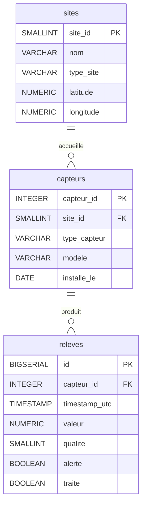

# Schéma de la base de données

## Cardinalités

| Relation | Gauche | Droite |
|---|---|---|
| sites → capteurs | 1 site | N capteurs (8 sites, 50 000 capteurs) |
| capteurs → releves | 1 capteur | N relevés (50 000 capteurs, 1 000 000 relevés) |

## Colonnes clés pour les démos d'index

| Colonne | Table | Cardinalité | Cas d'usage |
|---|---|---|---|
| `capteur_id` | releves | Haute (50 000) | Index B-tree très sélectif |
| `timestamp_utc` | releves | Haute | `BETWEEN`, `ORDER BY` |
| `alerte` | releves | Très basse (~2% TRUE) | Index partiel spectaculaire |
| `traite` | releves | Basse (~70% TRUE) | Seq Scan attendu |
| `site_id` via capteurs | — | Très basse (8 valeurs) | Seq Scan attendu |
